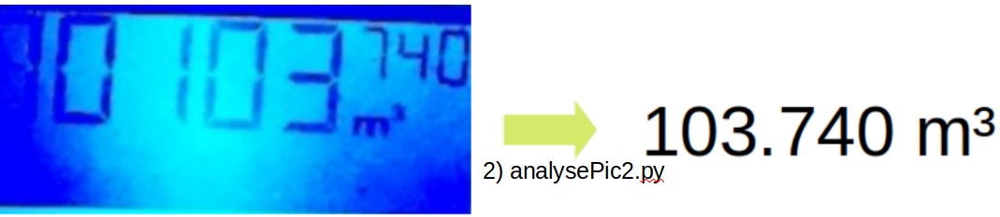
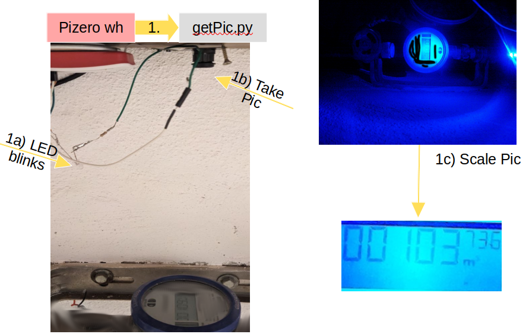

# Analog 2 Digital 7 segment reader
Reading out a seven segement display and convert the image in a number
seems to be an easy task however in practice I figured out it is not....

## Why do I need it at all?
Sometimes you have to deal with old analog hardware (water clock, electricity meter).

**Hardware setup**

## Basic image processing approach
imgs here SEE ORGINAL dATA RESULTS.

## Neuronal Network approach
