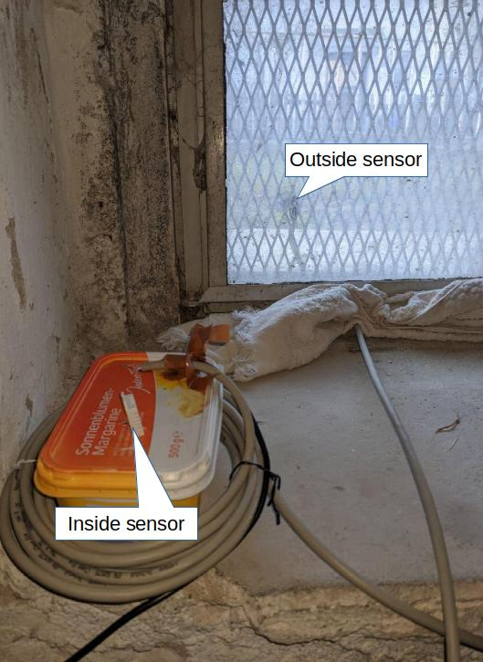
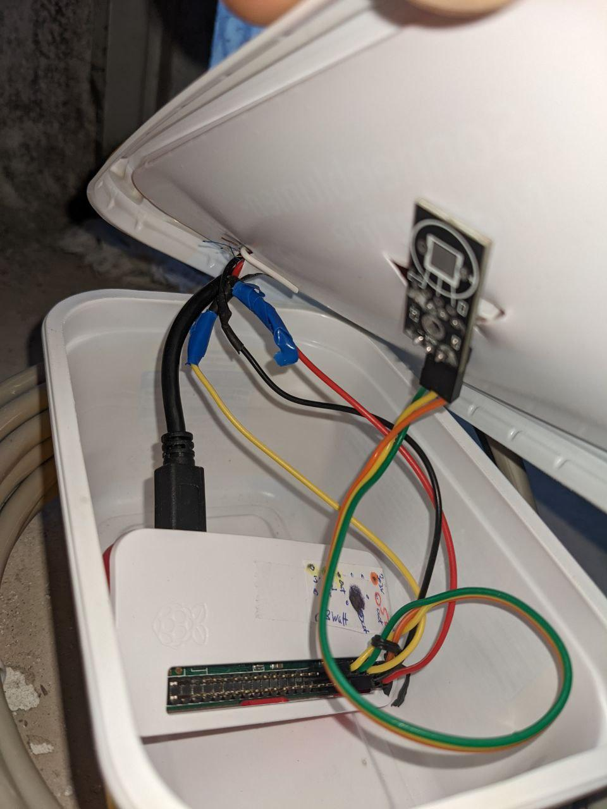

## Hardware
* 2 [DHT22 sensors](https://www.amazon.de/AZDelivery-Temperatursensor-Luftfeuchtigkeitssensor-Platine-Arduino/dp/B07TTJNY1C/ref=sr_1_5?__mk_de_DE=%C3%85M%C3%85%C5%BD%C3%95%C3%91&dchild=1&keywords=DHT22%2BTemperature&qid=1607717102&sr=8-5&th=1) that measure
  * temperature +-0.5° and
  * humidity +- 5%
* [raspberry pi zero wh](https://www.amazon.de/Raspberry-Pi-Zero-WH-512/dp/B07C7FHJDX/ref=sr_1_3?__mk_de_DE=%C3%85M%C3%85%C5%BD%C3%95%C3%91&dchild=1&keywords=raspberry+pi+zero+w&qid=1607717301&quartzVehicle=3443-316&replacementKeywords=raspberry+pi+w&sr=8-3) or [here](https://www.berrybase.de/raspberry-pi-co/raspberry-pi/boards/raspberry-pi-zero-wh)
* 5V,1A power + cable to miniUSB    
* jumper cables, one longer telefone cable or LAN cable
* the longer cable is required for the outside sensor
* optinal [powerbank](https://www.amazon.de/iposible-Powerbank-%E3%80%90Neuestes-Kapazitat-Ladeger%C3%A4t/dp/B07MKRTPTT/ref=sr_1_4_sspa?__mk_de_DE=%C3%85M%C3%85%C5%BD%C3%95%C3%91&dchild=1&keywords=powerbank+20000mah+raspberry+pi&qid=1607718391&sr=8-4-spons&psc=1&spLa=ZW5jcnlwdGVkUXVhbGlmaWVyPUFQWlRPTFMxODBYUjMmZW5jcnlwdGVkSWQ9QTAyMjY3NDMxV1QyTkNVSjM2RlBJJmVuY3J5cHRlZEFkSWQ9QTA1NTM3OTIzVEJIT0RZQkRGVUhWJndpZGdldE5hbWU9c3BfYXRmJmFjdGlvbj1jbGlja1JlZGlyZWN0JmRvTm90TG9nQ2xpY2s9dHJ1ZQ==)
* >=4Gb SD-card

**Setup inside outside sensor**

**Inside the Box**



# Changelog
see commits
* v0.1          worked for one and two DHT Sensor Data (see files in data)
* v0.2          added min, max Option
* v0.3          added Adafruit_CircuitPython_DHT lib

## Usefull commands
```bash
#Login:
ssh pi@pitwo.local # for second raspberry pi!
ssh pi@raspberrypi.local PW=raspberry
# Copy logging files from REMOTE to your PC
sudo scp -r pi@raspberrypi.local:*_logging.txt ~/Documents
sudo scp -r pi@raspberrypi:*.png ~/Documents
sudo scp -r pi@raspberrypi:/etc/systemd/system/send_mail.service ~/Documents
sudo scp -r pi@raspberrypi:/etc/systemd/system/send_mail.timer ~/Documents
sudo scp -r pi@raspberrypi:/etc/systemd/system/dht_logger.service ~/Documents
# get Logging
journalctl -u dht_logger.service
journalctl -u send_mail.service
# status, start, stop, enable(at boot), disable the service
sudo systemctl start dht_logger.service
sudo systemctl status send_mail.service
#if you change a service file do:
sudo 	systemctl daemon-reload
```

## TODO
* LiCR!
* picle stuff
* optinal: webstation: https://medium.com/initial-state/build-an-inexpensive-network-of-web-connected-temperature-sensors-using-pi-zeros-730a40f1fb60
* check if code for 2 sensors works also for one sensor!

## Files
On the pi:
```
2022-03-04_06:57:40_logging.txt # contains logging files
all.png, last_100.png,...       # images generated by send_mail
dht_logger.py                   #py3 to get hum, temp data
send_mail.py                    #py3 program to send an email and generate images
# wheel for adafruit lib to read sensor data:
test -> Adafruit_Python_DHT -> Adafruit_DHT  Adafruit_DHT.egg-info  build  dist
# cd /etc/systemd/system:
send_mail.timer, send_mail.service, dht_logger.service
```

## Setting it up
**Important Note**
There are two libs around - I tested both of them:
* [Adafruit_CircuitPython_DHT](https://github.com/adafruit/Adafruit_CircuitPython_DHT), [docu](https://docs.circuitpython.org/projects/dht/en/latest/)
   + requires python 3.8 -> so choose most recent rasp image
   + is optimized but does not work perfectly for me as described [here](https://github.com/adafruit/Adafruit_CircuitPython_DHT/issues/49#issuecomment-1065914973) and [here](https://learn.adafruit.com/modern-replacements-for-dht11-dht22-sensors/overview)
   + negative temperature values work for the DHT22
* [Adafruit-lib](https://github.com/adafruit/Adafruit_Python_DHT)
  + got problems with negative temperature values

### Full SetUp
* `sudo apt-get install rpi-imager`
* Choose Raspberry PI OS Lite (32Bit) 2022-01-28
* Flash it to your SD Card
* create wlan file: wpa_supplicant.conf in boot
```
ctrl_interface=DIR=/var/run/wpa_supplicant GROUP=netdev
update_config=1
country=US

network={
	ssid="wifi-name-here"
	psk="pw_of_wifi_here"
	key_mgmt=WPA-PSK
}
```
* After the first boot this file will be copied to /etc/wpa_supplicant/*
* create also an empty ssh file under /boot
* Boot once and may change the hostname (if you have multiple pi's)
  + `sudo nano /etc/hosts`raspberry change to pitwo(=your Hostname)
  + `sudo nano /etc/hostname` change to pitwo
* To save some energy open /boot/config.txt and insert after audio=on
```
# Enable audio (loads snd_bcm2835)
#dtparam=audio=on

# Disable bluetooth - added by Markus:
dtoverlay=disable-bt
#dtoverlay=disable-wifi

# TODO Disable the ACT LED.
dtparam=act_led_trigger=none
dtparam=act_led_activelow=off
```
* Copy the send_mail.py, dht_logger.py to rootfs/home/pi (via mouse clicking)
* Copy the services (dht_logger.service, send_mail.service, send_mail.timer):
```
sudo scp dht_logger.service send_mail.timer send_mail.service /media/markus/rootfs/etc/systemd/system/
```
* Connect the pi as described above
* Insert the SD card, power your pi zero
```
ssh pi@raspberrypi.local
# ssh pi@pitwo.local
```
* After first boot do
```
# Make files executable
chmod +x dht_logger.py
chmod +x send_mail.py
chmod +x /etc/systemd/system/[dht_logger.service, send_mail.service, send_mail.timer]

# check python version >3.8
python --version

# Install software
sudo apt-get update
sudo apt dist-upgrade -y
sudo rpi-update
#  C library for interacting with Linux GPIO device
sudo apt-get install libgpiod2
sudo apt install python3-pip
# from: https://github.com/adafruit/Adafruit_CircuitPython_DHT#basics install
sudo pip3 install adafruit-circuitpython-dht
cd /home/pi
python3 minimal.py
```
* Put service to autostart at boot:
```
sudo systemctl enable dht_logger.service
sudo systemctl enable send_mail.service
sudo systemctl enable send_mail.timer
sudo reboot
```
Is this required?
pi@pitwo:~ $ sudo cp /etc/systemd/system/dht_logger.service /lib/systemd/system/dht_logger.service
pi@pitwo:~ $ sudo chmod 644 /lib/systemd/system/dht_logger.service

* Some Timer commands / hints:
```
sudo systemctl daemon-reload
sudo systemctl start send_mail.timer
sudo systemctl list-timers --all

/etc/systemd/system $ sudo nano send_mail.timer
[Timer]
OnCalendar=*-*-* 07:00:00
Unit=send_mail.service
Persistent=true
```
* If you want to use an outside sensor
 + max. cable length for 5V -> 30m
 + max. cable length for 3.3V -> 1m
 + I used around 5m cable lenght at 5V and it works.
 + Details see [here](https://forums.raspberrypi.com/viewtopic.php?f=44&t=104359&p=1156616&hilit=nRF24L01#p742704)
   and [here](https://forums.raspberrypi.com/viewtopic.php?t=195959)
 + A good cable would be one that is shielded as e.g. a CAT cable

* Multiply your setup
  + e.g. you have the same setup double do these commands for the SD card of your   setup1
  + Follow [this](https://askubuntu.com/questions/227924/sd-card-cloning-using-the-dd-command) for cloning to another SD card: worked out of the box!
  + you can also check [this setup](https://www.pragmaticlinux.com/2020/12/how-to-clone-your-raspberry-pi-sd-card-in-linux/)
  ```
  lsblk -p
  sudo dd bs=4M if=/dev/mmcblk0 of=~/Downloads/circ_adafruit_5.1_raspbian_lite.img conv=fsync
  # for shrinking (from 15Gb to 2.7Gb)
  cd ~
  wget https://raw.githubusercontent.com/Drewsif/PiShrink/master/pishrink.sh
  chmod +x pishrink.sh
  sudo mv pishrink.sh /usr/local/sbin/pishrink
  sudo pishrink ~/Downloads/pi_img.img
  ```
  + Change hostname for multiple pi's:
  ```
     ssh pi@raspberrypi.local
     sudo nano /etc/hosts
     ssh pi@raspberrypi.local
     ssh pi@pitwo.local
   ```
* Wrong time-zone on pi zero wh?
`sudo raspi-config -> choose 5 regional settings set to Berlin for DE`


## Licr controlling an air conditioning system
with respect to the inside and outside humidity!

IR:
Hey Dave super danke dir, ja mir gehts erstmal nur darum dass ich die richtige Hardware kaufe.
hm ich muss ja nur nen IR signal senden und am Anfang einmal empfangen um die Codes zu haben
reicht als Sender nicht auch z.B. das hier:
https://www.conrad.de/de/p/iduino-1485309-ir-sender-passend-fuer-einplatinen-computer-arduino-1-st-1485309.html?gclid=Cj0KCQiAu62QBhC7ARIsALXijXTd_fF3tBfERUovFZUUl7yUW64qx1At6ELUJ0azcVjY8EJmR74JU20aAgECEALw_wcB&insert_kz=VQ&hk=SEM&WT.srch=1&WT.mc_id=google_pla&s_kwcid=AL!222!3!549014662526!!!u!!&ef_id=Cj0KCQiAu62QBhC7ARIsALXijXTd_fF3tBfERUovFZUUl7yUW64qx1At6ELUJ0azcVjY8EJmR74JU20aAgECEALw_wcB:G:s


IR Sensor Licht
https://gist.github.com/prasanthj/c15a5298eb682bde34961c322c95378b -> Anleitung
https://forum-raspberrypi.de/forum/thread/55410-infrarot-fernbedienung-automatisieren/?postID=520883#post520883
https://www.youtube.com/watch?v=O8iYPg5DSXw

https://templates.blakadder.com/LQ-08.html

DIESE ANLEITUNG:
https://www.instructables.com/Raspberry-Pi-Zero-Universal-Remote/
https://www.instructables.com/Raspberry-Pi-Zero-Universal-Remote/
Teile hier bestellen: https://www.digikey.de/de/products/result?s=N4IgTCBcDaIHIAU4AIAuAnAhgOwM4EtdUB7dEAXQF8g

Fensteröffner mit Linearschiene!
https://www.banggood.com/de/Machifit-100-500mm-Stroke-Linear-Actuator-CNC-Linear-Motion-Lead-Screw-Slide-Stage-with-Stepper-Motor-p-1804534.html?cur_warehouse=CN&ID=517377&rmmds=search

## Battery considerations
- stromverbrauch laut messgerät 0.8 Watt
  -> Verbrauch pro Tag: 0.0192 kW
  -> pro Monat 0.576 kW
  -> pro Jahr 6.912
  -> *30cT = 2.1e
  ## Berechnung AkkuLaufzeit
  * Nennkapazität Akku in mAH
  * Nennspannung des Akkus in V
  * Leistungsaufnahme Verbraucher in W
  --> (3.2V x 2Ah / 3W) =

  -->(3V *3Ah/3W) = 3h

  (5V*11Ah)/3W = 18h
  https://www.amazon.de/Powerbank-Zusatzakku-Raspberry-gleichzeitig-hochwertig-wei%C3%9F-grau/dp/B015WHKPQ4

  (5V*28,6)/3W  = 47h
  https://www.amazon.de/dp/B07TB7G9CS/ref=sspa_dk_detail_3?psc=1&pd_rd_i=B07TB7G9CS&pd_rd_w=pV4kV&pf_rd_p=403c666b-0b30-4f66-afde-0388ffdf2c39&pd_rd_wg=jkDSm&pf_rd_r=4QBVZABP610JP5TAABRW&pd_rd_r=930eefcc-27da-49aa-b1a2-59d9ac138fca&spLa=ZW5jcnlwdGVkUXVhbGlmaWVyPUEzRzZENFM4WTlaRUVUJmVuY3J5cHRlZElkPUEwNzc5OTgyVjZVQkZGOFE5WlZXJmVuY3J5cHRlZEFkSWQ9QTAwODczMTAzMVlFMk9WUkE0MkJNJndpZGdldE5hbWU9c3BfZGV0YWlsJmFjdGlvbj1jbGlja1JlZGlyZWN0JmRvTm90TG9nQ2xpY2s9dHJ1ZQ==

  * Power Consumption = 0.5W
  * battery pack with 5V out,
  * (25.8Ah * 5V)/(24*7*0.5) = 10.7 Tage!!!

20.12.2020 7h habe ich schon geschafft --> Verbrauch von 370mA (weit von 80mA entfernt) (liegt evtl. auch an schechter Power Bank)

  Stromverbrauch arduino: 1,4 Watt

I'm currently testing my RPi Zero W with temp, humidity and barometric pressure sensors hooked up. I have two 3,000 mAh batteries wired in parallel. They also go through an Adafruit regulator. Once I had my python script running, I disconnected the keyboard and mouse since they won't be connected when my final project is finished.

In this configuration, i was able to get 8 Hrs and ten minutes on my RPi 3B in the exact same configuration. I'll know today how long the Zero W will run and I'll post it here.

Update: In the configuration mentioned, it ran just a hair, (5 minutes) over 14 hours. All it does is read the sensors once every 10 minutes and insert them into a MySQL table. I'm also running Lighttpd web service. Hope this is helpful.

If you decide to go with Lithiium/ion batteries, be careful; there is some real garbage on ebay and amazon claiming to be 9800 mAh. They're garbage. These are an honest 3000 mAh. Good luck.

### Power connection
https://www.youtube.com/watch?v=6cU-QTq6Zb8

### Energie sparen
BlueTooth ausschalten dtoverlay=disable-bt
runter takten --> is not worth it
sleep mode und nur für datenübertragung starten

### CPU Spannung:
vcgencmd measure_volts= 1.2
#Aktuelle Frequenz des Prozessors abfragen:
vcgencmd measure_clock arm = 700kHz

PI Zero maximal auf 80mA
--> 5*2,6/0,4 = 32,5 h

## Common Erros:
- python3 dht_logger.py
Logging started to home/pi/2022-02-13_22:31:07_logging.txt
Traceback (most recent call last):
  File "dht_logger.py", line 13, in <module>
    logging.basicConfig(format='%(asctime)s %(message)s', filename=file_name, level=logging.INFO, datefmt='%Y-%m-%d %H:%M:%S')
  File "/usr/lib/python3.5/logging/__init__.py", line 1745, in basicConfig
    h = FileHandler(filename, mode)
  File "/usr/lib/python3.5/logging/__init__.py", line 1009, in __init__
    StreamHandler.__init__(self, self._open())
  File "/usr/lib/python3.5/logging/__init__.py", line 1038, in _open
    return open(self.baseFilename, self.mode, encoding=self.encoding)
FileNotFoundError: [Errno 2] No such file or directory: '/home/pi/home/pi/2022-02-13_22:31:07_logging.txt'
-> fehler ist normal wenn man dht_logger manuell startet!!!
- with new lib this error shows up:
pi@pitwo:~ $ sudo systemctl status dht_logger
● dht_logger.service - dht logging service
     Loaded: loaded (/etc/systemd/system/dht_logger.service; disabled; vendor preset: enabled)
     Active: failed (Result: exit-code) since Sat 2022-03-12 20:16:26 GMT; 4min 9s ago
    Process: 693 ExecStart=/usr/bin/python3 /home/pi/dht_logger.py (code=exited, status=1/FAILURE)
   Main PID: 693 (code=exited, status=1/FAILURE)
        CPU: 2.909s

Mar 12 20:16:25 pitwo python3[693]:   File "/usr/local/lib/python3.9/dist-packages/adafruit_dht.py", line 86, in __init__
Mar 12 20:16:25 pitwo python3[693]:     self.pulse_in = PulseIn(self._pin, maxlen=self._max_pulses, idle_state=True)
Mar 12 20:16:25 pitwo python3[693]:   File "/usr/local/lib/python3.9/dist-packages/adafruit_blinka/microcontroller/bcm283x/pulseio/PulseIn.py", line 83, in __init__
Mar 12 20:16:26 pitwo python3[693]:     message = self._wait_receive_msg(timeout=0.25)
Mar 12 20:16:26 pitwo python3[693]:   File "/usr/local/lib/python3.9/dist-packages/adafruit_blinka/microcontroller/bcm283x/pulseio/PulseIn.py", line 101, in _wait_receive_msg
Mar 12 20:16:26 pitwo python3[693]:     raise RuntimeError(
Mar 12 20:16:26 pitwo python3[693]: RuntimeError: Timed out waiting for PulseIn message. Make sure libgpiod is installed.
Mar 12 20:16:26 pitwo systemd[1]: dht_logger.service: Main process exited, code=exited, status=1/FAILURE
Mar 12 20:16:26 pitwo systemd[1]: dht_logger.service: Failed with result 'exit-code'.
Mar 12 20:16:26 pitwo systemd[1]: dht_logger.service: Consumed 2.909s CPU time.
-> **Solution** in the service  file under [Service] add User=pi

- current issue with new lib: https://github.com/adafruit/Adafruit_CircuitPython_DHT/issues/49

## Older instructions

* simply get the image to your USB card!
* [Adafruit-lib](https://github.com/adafruit/Adafruit_Python_DHT)

pip3 (sollte was ausgeben)

pip3 install adafruit-circuitpython-dht
sudo apt-get update

# upgrade to buster in order to install libgpiod2
sudo apt dist-upgrade -y
(takes forever)
sudo rpi-update
sudo nano /etc/apt/sources.list

sudo apt-get install libgpiod2 # C library for interacting with Linux GPIO device -


Diese Anleitung geht
(git installieren und dann läuft)
https://buyzero.de/blogs/news/tutorial-dht22-dht11-und-am2302-temperatursensor-feuchtigkeitsensor-am-raspberry-pi-anschliessen-und-ansteuern
mit PIN4

python3 AdafruitDHT.py 22 4
* https://downloads.raspberrypi.org/raspios_lite_armhf/images/raspios_lite_armhf-2020-12-04/
--> 2020-12-02-raspios-buster-armhf-lite.zip
* ssh and .config copy to boot

systemd
sudo nano /lib/systemd/system/dht_logger.service
/etc/systemd/system $ sudo nano dht_logger.service <-- ist zwingend erforderlich!

/etc/systemd/system
sudo systemctl status dht_logger
sudo 	systemctl daemon-reload

sudo systemctl restart dht_logger
Environment=PYTHONUNBUFFERED=1
/var/log/syslog <-- logging is inside here!

sudo nano /home/pi/.bashrc
