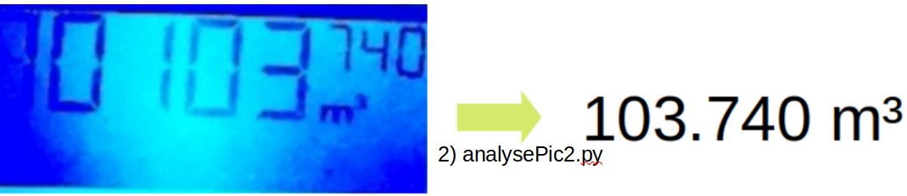
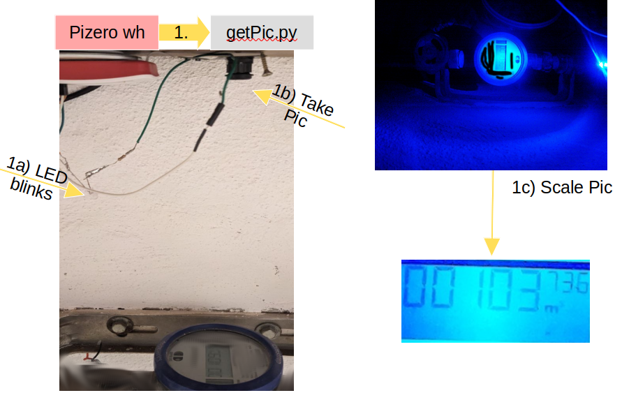

This pitwo sensor is used to collect data for 3 systems:
* water clock
* temperature & humidity in the cellar
* zisterne (connected over a WEMOS)
# Analog 2 Digital 7 segment reader
Reading out a seven segement display and convert the image in a number
seems to be an easy task however in practice I figured out it is not....



## Why do I need it at all?
Sometimes you have to deal with old analog hardware (water clock, electricity meter).

### Hardware setup



## Basic image processing approach
imgs here SEE ORGINAL dATA RESULTS.


## Neuronal Network approach


# Zisterne

## Copy files from pitwo
scp pitwo@pitwo:/home/pitwo/zisterne/zisterne.txt /home/markus/Desktop/smarAir/zisterne/zisterne.txt

# Temperature Data

## Install
```bash
# install adafruit lib for DHT22 sensors
pip3 install adafruit-circuitpython-dht # see https://github.com/adafruit/Adafruit_Python_DHT
sudo apt-get update

# copy service files
scp -r /home/markus/Desktop/smarAir/temp/*.py pitwo@pitwo:/home/pitwo/temp/  
scp -r /home/markus/Desktop/smarAir/temp/*.service pitwo@pitwo:/home/pitwo/temp/
scp -r /home/markus/Desktop/smarAir/temp/*.timer pitwo@pitwo:/home/pitwo/temp/
# enable service files
sudo systemctl enable send_mail.service
sudo systemctl enable send_mail.timer
sudo systemctl enable dht_logger.service
sudo reboot
# monitor status / check for errors
sudo systemctl status dht_logger.service
python3 dht_logger.py
journalctl -u dht_logger.service
 ```

