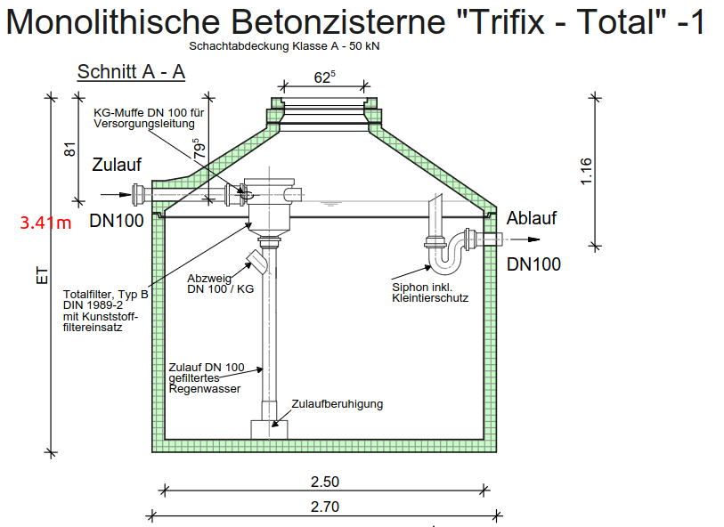

This pitwo sensor is used to collect data for 3 systems:
* water clock
* temperature & humidity in the cellar
* zisterne (connected over a WEMOS)
# Analog 2 Digital 7 segment reader
Reading out a seven segement display and convert the image in a number
seems to be an easy task however in practice I figured out it is not....


## Why do I need it at all?
Sometimes you have to deal with old analog hardware (water clock, electricity meter).

### Hardware setup


## Basic image processing approach
[inspired by](https://pyimagesearch.com/2017/02/13/recognizing-digits-with-opencv-and-python/)
imgs here SEE ORGINAL dATA RESULTS.

TODO !!! 


## Neuronal Network approach

TODO !!! 

# Zisterne


[For more see here](https://www.regenwasser-boehm.de/Betonzisterne-Typ-TrifixTotal)

measure water level with [ a pegelsonde in combination with a wmos D1 mini](https://www.ebay.de/itm/304637631892?chn=ps&var=603669515927&norover=1&mkevt=1&mkrid=707-134425-41852-0&mkcid=2&mkscid=101&itemid=603669515927_304637631892&targetid=1405537545258&device=c&mktype=pla&googleloc=9042785&poi=&campaignid=17935704717&mkgroupid=139162549385&rlsatarget=pla-1405537545258&abcId=9301059&merchantid=7364532&gclid=Cj0KCQjw84anBhCtARIsAISI-xdWg1jVoXsAjIUpW6LzJZhx5lf2w_psBCh8_g_aanzGhKCKOPjnmxIaAuDyEALw_wcB)

after installation the tasmota range can be seen at: http://192.168.178.xx

## Copy files from pitwo
```
scp pitwo@pitwo:/home/pitwo/zisterne/zisterne.txt /home/markus/Desktop/smarAir/zisterne/zisterne.txt
```

## Transform Data
|Tasmota Range | Water pillar* | l | % |
|---------| ----| --|  --| 
|  1767** | 2.51m |  2.51xpix1.25²=12.321 |  100 |
|  0? | 0m |  0 |  0 |

*Water pillar: Water level in m measured by hand from the ground

**Under heavy rain fail this value can be 1824. In this case the preasure on the sensor is temporary a little bit higher.


TODO: curently I use a corrector factor cause the tasmota range conversion to
the water pillar hight does not match 100%.

Note Tasmota range to water pillar is currently not 100% correct adjusted. That is why I use this corrector factor
corrector_factor: 12463-12321 = 142l = 0.0289m water pillar

## Retrieve Data
The zisterne.sh script is started every 180 secs using a service:
```
[Unit]
Description=zisterne service

[Service]
Restart=always
RestartSec=180s
ExecStart=/bin/bash /home/pitwo/zisterne/zisterne.sh

[Install]
WantedBy=multi-user.target
```


use **zisterne.sh** script to get the data from tasmota:
```
range=$(curl -s http://192.168.178.139/cm?cmnd=STATUS+8 | jq '.StatusSNS.ANALOG.Range')
date=$(curl -s http://192.168.178.139/cm?cmnd=STATUS+8 | jq -r '.StatusSNS.Time')
level=$(printf %.0f "$((range*1436782))e-6") 
level=$((level-29)) # corrector factor of 142l = 0.0289m = 28.9mm water pillar
liter=$(printf %.2f "$((level*314159*125*125))e-9")
perc=$(printf %.2f "$((level*314159*125*125*81162))e-16") # 100% = 12.321 m3
echo "Modell                  : Trifix Total "
echo "Date                    : $date "
echo "Tasmota range           : $range "
echo "Water level             : $level mm"
echo "Water(l) level*pi*1.25^2: $liter l"
echo "Percentage %            : $perc  %"
result="$date   $range  $level  $liter  $perc"

# Define the filename
filename='/home/pitwo/zisterne/zisterne.txt'

# Check the new text is empty or not
if [ "$range" != "" ]; then
      # Append the text by using '>>' symbol
      echo $result >> $filename
fi
```

## l/m² calculation
How do I know how many l per m² have fallen on one day?
This can be done via difficult calculation of setting your roof area, wind conditions, roof angle in relation to the saved water in your zistern.
TODO do the area calculation!

TODO
Or using wheather data [here](https://www.wetterkontor.de/de/wetter/deutschland/rueckblick.asp?id=U209)
e.g. on 12.09.23 it rained 14.1 l/m²
pip3 install adafruit-circuitpython-dht
# Temperature Data

## Install
```bash
# install adafruit lib for DHT22 sensors
pip3 install adafruit-circuitpython-dht # see https://github.com/adafruit/Adafruit_Python_DHT
sudo apt-get update

# copy service files
scp -r /home/markus/Desktop/smarAir/temp/*.py pitwo@pitwo:/home/pitwo/temp/  
scp -r /home/markus/Desktop/smarAir/temp/*.service pitwo@pitwo:/home/pitwo/temp/
scp -r /home/markus/Desktop/smarAir/temp/*.timer pitwo@pitwo:/home/pitwo/temp/
# enable service files
sudo systemctl enable send_mail.service
sudo systemctl enable send_mail.timer
sudo systemctl enable dht_logger.service
sudo reboot
# monitor status / check for errors
sudo systemctl status dht_logger.service
python3 dht_logger.py
journalctl -u dht_logger.service
 ```


# Influx DB and Garfana
save the data in garfana and influx db!